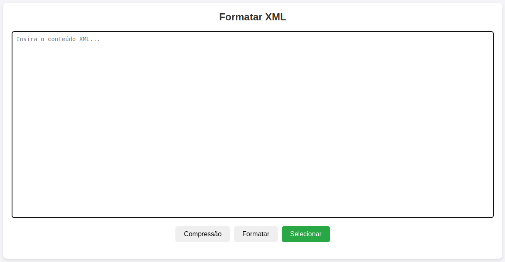

        _____          .__.__   __                    _________              __                
        /  _  \   _____ |__|  |_/  |_  ____   ____    /   _____/____    _____/  |_  ____  ______
       /  /_\  \ /     \|  |  |\   __\/  _ \ /    \   \_____  \\__  \  /    \   __\/  _ \/  ___/
      /    |    \  Y Y  \  |  |_|  | (  <_> )   |  \  /        \/ __ \|   |  \  | (  <_> )___ \ 
      \____|__  /__|_|  /__|____/__|  \____/|___|  / /_______  (____  /___|  /__|  \____/____  >
              \/      \/                         \/          \/     \/     \/                \/ 

# a1000ton-xml-Formatter

Este programa foi desenvolvido com o intuito de formatar XMLs de forma mais prática e rápida.

* Arquivo Javascript para formatar XML.

  

Author @amilton.dev